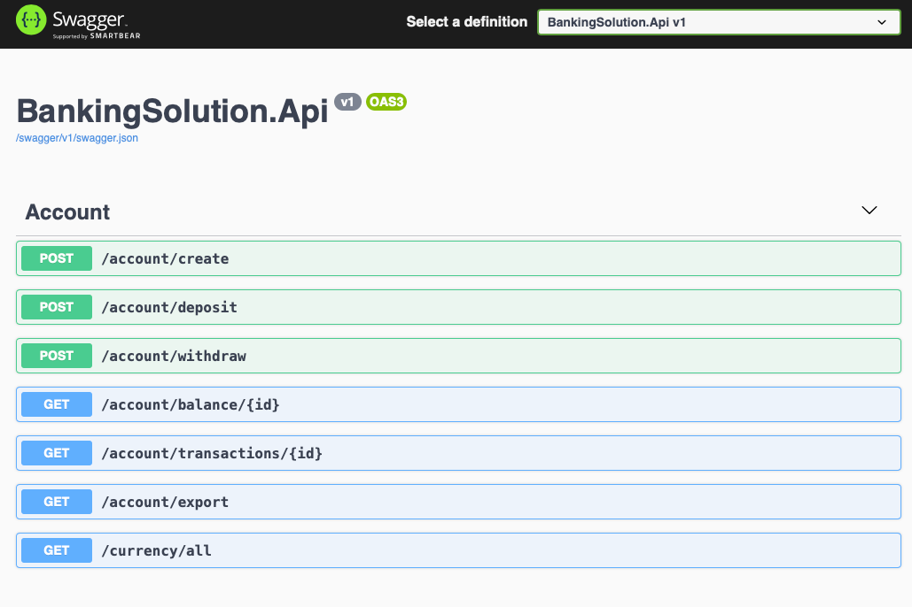

Pantheon Banking application mini-project.

## Setup:
1. .Net Core 5 with C#
2. Dependency Injection
2. Swagger page for WebApi- https://localhost:5001/swagger
3. EFCore - setup with an InMemory database.
4. Console loggings; In real life, my preferred choice will be Serilog log.
5. Unit Tests - with NUnit and Moq.
6. KestrelServerOptions is configured to allow AllowSynchronousIO
7. Cors is enabled and configure in the Web Api - enabling the UI to call into the Web Api.

In a real life application, some things will be done differently:

1. FluentValidation will be used instead of Model Validation via Data Annotation
2. I would use **multiple controllers** (eg: Account, Transactions, Currencies) or  use the pattern described in nuget package [ASP.NET Core API Endpoints](https://github.com/ardalis/ApiEndpoints) or use the Mediatr with commands/handlers.
3. Return a variety of Http Errors, eg: NoFound, NoContent etc

## Api Workflow

The first thing to do is Create an account; an account is created with an initial deposit.  After an account is created, you may use any of the other endpoints in any order.

* POST - /account/create - Creates the account
* POST - /account/deposit - Deposit into the account
* POST - /account/withdraw - Withdraws from the account
* GET - /account/balance/{id} - returns the current balance of the account.
* GET - /account/transactions/{id} - returns a list of transaction on the account
* GET - /account/export - exports all the transactions on the account into a csv file.
* GET - /currency/all - returns a list of valid currencies that can be used for deposit.

## Front End / UI in Angular 
**Status** - _started by not completed._

**Setup:**

* Angular CLI: 9.0.1
* Node: 12.15.0
* bootstrap
* AccountService in Angular have been created and most of the endpoint methods have been added.
